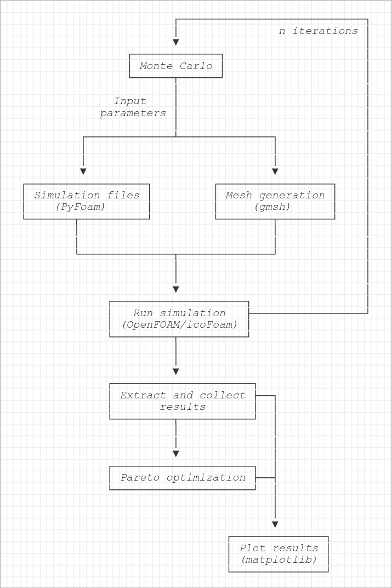

# SLPO (Simulation Launcher & Pareto Optimization) algorithm development for fluid dynamics multisimulations (OpenFOAM) and optimal case identification

This project has been presented as a final project for the Bachelor's degree in Industrial Electronics and Automatic Control Engineering at the Manresa School of Engineering (EPSEM) belonging to Universitat Politècnica de Catalunya (UPC) and directed by Enrique Bonet and Francesc Perez.

## Abstract

This project presents the development of the SLPO (Simulation Launcher & Pareto Optimization) algorithm, designed to automate fluid dynamics simulations and optimize design parameters using open-source computational fluid dynamics tools. The system studied is a simplified air injector, modeled as a curved pipe with a small inlet. Using Monte Carlo sampling, random parameter sets are generated, and simulations are conducted in OpenFOAM with the icoFoam solver for incompressible, isothermal fluid flow. Pareto optimization is applied to perform multiobjective optimization, identifying designs that balance the two competing objectives of minimizing inlet pressure and material cost. The algorithm explores the design space automatically and identifies Pareto optimal solutions. The workflow, built on Python, Gmsh, and PyFoam, offers a scalable approach to multiobjective optimization in CFD. While the case model is considered too simplisitic, the methodology demonstrates significant potential for more complex and practical engineering applications.

## Contents
This repository contains the source code for the main Python program of the project (src/main), documentation (docs) such as the project report itself and the slides used in the projects defense, and example results (example_results) from running the program to show case its outputs. The additional programs implemented to test the meshing time for a given mesh setting are provided as well (src/mesh_time_test). A docker container environment is provided for running the main program consistently (src/docker).

```
.
├── README.md
├── images
├── docs
│   ├── project_presentation.pdf
│   └── project_report.pdf
├── src
│   ├── main
│   │   ├── func.py
│   │   ├── run.py
│   │   └── test.py
│   ├── docker
│   └── mesh_time_test
└── example_results
```

## Main program

The main program (src/main) is composed of the main executable run.py and the functions file func.py, together with a test file for running a single simulation instance, test.py. The program follows this functional architecture:


